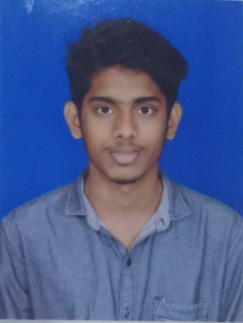

# Kushal Senapathi

📍 Baltimore, MD • 📱 410-649-9112 • ✉️ kushalsenapathi@gmail.com  
🔗 [LinkedIn](https://linkedin.com/in/kushalsenapathi)

---

## 🎯 Summary
Detail-oriented **Data Science graduate student** with practical experience in **data cleaning, analysis, and visualization** across healthcare, system monitoring, and AI applications. Proficient in SQL, Excel, Tableau, Power BI, and Python libraries (Pandas, NumPy, Matplotlib).  

Developed projects including:  
- **AI-powered meal planner** using USDA API  
- **Lung segmentation model with U-Net** for medical imaging   

Skilled in generating insights, building dashboards, and supporting **data-driven decision-making**. 
---

## 💼 Work Experience

### **Data Science Intern** – SmartKnower  
*Aug 2022 – Jan 2023*  
- Applied machine learning models (Decision Tree, Random Forest, Logistic Regression, KNN, SVC) to predict annual income, achieving **85% accuracy** with Random Forest.  
- Preprocessed datasets by renaming columns, handling null values, and splitting into train/test sets.  
- Evaluated model performance using **Precision, Recall, F1-score, and Accuracy**.  
- Reduced misclassification rate to **15%** by fine-tuning hyperparameters and optimizing models.  
- Generated visualizations (Confusion Matrices, Classification Reports) to assess and explain performance.  

---

## 📂 Projects

### **Spotify Song Popularity Prediction**
- Used machine learning techniques to predict song popularity based on audio features (e.g., danceability, energy, loudness).  
- Collected and cleaned data from the **Spotify API** with 24,995 rows and 23 features, including track metadata and audio attributes.  
- Implemented regression and classification models, including **Ridge Regression** and **Random Forest**, improving predictions through feature engineering.  
- Achieved better results with **Bagging Classifier**, balancing accuracy and ability to predict popular songs effectively.  
- Analyzed results using **confusion matrices** and explored model improvement strategies for future work.  

---

### **Lung Segmentation with U-Net**  
*Python, PyTorch, NumPy, OpenCV*  
- Built and trained a **U-Net convolutional neural network** to perform semantic segmentation on chest X-ray images.  
- Handled **data preprocessing, augmentation, and IoU-based evaluation** to improve prediction accuracy and generalizability.  
- Demonstrated application of **deep learning to real-world medical imaging** problems.  

---

## 🛠 Skills
- **Programming & Data:** Python, SQL, R, Excel, Pandas, NumPy, Matplotlib  
- **Visualization:** Tableau, Power BI  
- **Machine Learning:** Scikit-learn, Random Forest, Logistic Regression, SVC, KNN  
- **Deep Learning:** PyTorch, CNNs, U-Net  
- **Other Tools:** Git, Jupyter Notebook  

---

## 🎨 Interests
- Machine Learning  
- Open-source projects  
- Cricket and Hiking

